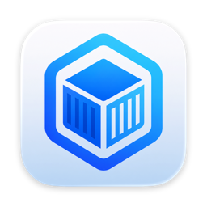
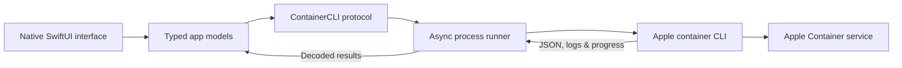

<div align="center">



# Container GUI

### Apple Container, without the command-line friction.

A native macOS control center for running containers, managing images,
watching resource usage, and keeping the Apple Container service healthy.

[](https://www.apple.com/macos/)
[](#requirements)
[](https://developer.apple.com/xcode/swiftui/)
[](https://github.com/apple/container)

[Get started](#getting-started) · [Explore features](#everything-you-need-in-one-window) · [Develop](#development) · [Troubleshoot](docs/TROUBLESHOOTING.md)

</div>

---

Container GUI wraps Apple's [`container`](https://github.com/apple/container)
CLI in a focused SwiftUI experience. It handles the everyday container
workflow—from guided setup to logs and live statistics—while executing commands
directly, never through a shell.

## Everything you need in one window

| | Capability | What you can do |
| :---: | --- | --- |
| 📦 | **Containers** | Search, filter, run, create without starting, start, stop, signal, prune, and safely delete containers. |
| ⌨️ | **Commands & files** | Run a one-off command inside a running container, hand the interactive form to Terminal, copy files in and out, and export a container's filesystem as a tar archive. |
| 🔎 | **Deep inspection** | Explore structured container configuration, networking, ports, mounts, image variants, and OCI metadata. |
| 📜 | **Logs & stats** | Follow bounded logs and monitor CPU, memory, network, and block I/O. |
| 🖼️ | **Images** | Search local images, inspect metadata, stream pull progress, run, and delete with dependency-aware cleanup. |
| 🛠️ | **Builds** | Build tagged images from a local Dockerfile with arguments, labels, target/platform, cache, resource, pull, and output controls. |
| 💾 | **Volumes** | List, search, inspect, create, delete, and prune persistent volumes across Apple Container 0.12 and 1.x JSON shapes. |
| 📂 | **Container storage** | Mount named volumes or host folders into new containers, with optional read-only access. |
| 🌐 | **Networks** | List, search, inspect, create, delete, and prune networks, with Apple Container 0.12 and 1.x compatibility. |
| 🔗 | **Container networking** | Attach a new container to multiple networks with optional MAC addresses and MTUs. |
| 🧭 | **Local DNS** | Review resolver readiness, then set the service domain in `config.toml` and add or remove local domains in `/etc/resolver` — the app makes both changes for you, asking macOS to authenticate you for the one that needs root. |
| ❤️ | **System health** | Check CLI, server, and image-builder status; control their lifecycles; and review disk usage, the service configuration, and recent logs. |
| ⬆️ | **Update checks** | See when a newer Container GUI release exists, read its notes, and copy the upgrade command. |
| 🩺 | **Diagnostics** | Copy a sanitized support report with common secrets and credentials redacted. |

### Designed to feel at home on macOS

- A native `NavigationSplitView`, searchable tables, inspectors, sheets, and
  familiar keyboard shortcuts.
- Guided onboarding for a missing executable, incompatible CLI, or stopped
  background service.
- Context-aware actions that disable invalid operations and prevent conflicting
  work on the same resource.
- Clear progress, cancellation, empty states, and actionable error messages
  throughout the app.

## Getting started

### 1. Check the requirements

- An **Apple-silicon Mac** running **macOS 26 or later**
- [Apple Container](https://github.com/apple/container/releases) CLI version
  **0.12.0 or later and earlier than 2.0.0**
- Xcode, when building Container GUI from source

### 2. Install Apple Container

Download Apple Container from its
[official releases](https://github.com/apple/container/releases) and complete
its installation. Container GUI normally discovers the executable at
`/usr/local/bin/container` or `/opt/homebrew/bin/container`; you can also choose
a custom executable during onboarding.

### 3. Install Container GUI

```sh
curl -fsSL https://raw.githubusercontent.com/Bramgus12/container-gui/main/scripts/install.sh | bash
```

The installer downloads the latest release disk image, checks its SHA-256
against the checksum GitHub publishes for the release asset, verifies the app's
code signature, and installs it into `/Applications`. Because releases are
notarized, macOS accepts the app on first launch with no approval step.

To read the script before running it:

```sh
curl -fsSL https://raw.githubusercontent.com/Bramgus12/container-gui/main/scripts/install.sh -o install.sh
```

Then review `install.sh` and run `bash install.sh`.

Useful options: `--version v1.2.0` pins a release, `--user` installs into
`~/Applications` and never asks for an administrator password, `--dir <path>`
chooses another location, and `--uninstall` removes the app while keeping its
settings. Re-running the command upgrades an existing installation in place.

On first launch, the app verifies the platform, executable, CLI version, and
service health before opening the main interface. If the service is installed
but stopped, it can be started directly from onboarding.

Once a day the app asks GitHub whether a newer release exists and shows the
result under **System → Updates**, where the check can also be run on demand or
turned off entirely. **Container GUI → Check for Updates…** checks immediately.
Updating is always the same one-line command as installing.

> [!NOTE]
> Container GUI releases are signed with a Developer ID Application certificate
> and notarized by Apple, and the notarization ticket is stapled to both the app
> and the disk image. Gatekeeper accepts them without any approval detour, and
> the check works offline. Releases up to and including 1.2.0 were ad-hoc signed
> and not notarized.

### Installing from the DMG by hand

Download `Container-GUI.dmg` from the
[releases page](https://github.com/Bramgus12/container-gui/releases) and compare
its SHA-256 with the checksum in the release notes:

```sh
shasum -a 256 ~/Downloads/Container-GUI.dmg
```

Open the disk image and drag **Container GUI.app** to the Applications folder.
Because the app is Developer ID signed and notarized, macOS opens it after the
one-time "downloaded from the Internet" confirmation that every browser download
gets, in which it reports that Apple checked the app for malicious software.
There is no **Privacy & Security** detour. Confirm the signature and the stapled
notarization ticket yourself with:

```sh
spctl --assess --type execute --verbose=4 "/Applications/Container GUI.app"
xcrun stapler validate "/Applications/Container GUI.app"
```

If macOS does block the launch, the copy is damaged or was tampered with after
signing. Delete it, download the DMG again, and compare the checksum before
retrying rather than approving it in **Privacy & Security**.

### Building from source

```sh
git clone https://github.com/Bramgus12/container-gui.git
cd container-gui
open container-gui.xcodeproj
```

In Xcode, select the **Container GUI** scheme and press <kbd>⌘</kbd><kbd>R</kbd>.

## How it works



Views never construct shell commands. Typed operations become discrete process
arguments, and JSON responses are decoded into app-owned models before they
reach the interface. The CLI layer is protocol-based, so tests can exercise the
complete workflow without touching real containers.

## Safety by design

Container management includes destructive and long-running operations, so the
app treats safety as a product feature:

- **No shell invocation.** The resolved executable is launched directly with
  validated, discrete arguments. The two commands that need root — creating and
  deleting a local DNS domain — are the one exception: they go through the macOS
  authentication dialog, which runs them in a shell, so every word of the command
  is single-quoted and every value it carries is validated first.
- **Administrator access only on request.** The app installs no privileged
  helper and holds no elevated rights. Each `/etc/resolver` change raises its own
  macOS password prompt, naming the domain it is about to change, and the copied
  `sudo` command stays available for anyone who would rather run it in Terminal.
- **Surgical config edits.** Setting the service DNS domain rewrites the one
  `domain` line under `[dns]` in `config.toml` and copies every other setting,
  comment, and blank line through unchanged. The write is atomic, and a file
  that states its DNS settings in a shape the app cannot edit safely is reported
  rather than rewritten.
- **Confirmation before destructive actions.** Delete, force delete, SIGKILL,
  container prune, image delete, network delete/prune, and service stop explain
  their impact before proceeding. Signals a process can handle are sent without
  a prompt.
- **Cancellable work.** Long-running child processes are terminated when their
  operation is cancelled.
- **Bounded output.** Retained command output and logs are capped to prevent
  unbounded memory growth.
- **Sanitized diagnostics.** Environment values are excluded and common secret,
  token, password, credential, authorization, private-key, and URL-userinfo
  patterns are redacted.

## Development

Open [`container-gui.xcodeproj`](container-gui.xcodeproj) and use the
**Container GUI** scheme. The project includes:

- unit tests for command construction, decoding, validation, and feature models;
- fake-process integration tests for streaming, cancellation, and failures; and
- UI tests backed by an in-process fake CLI that never modifies real containers.

Run the full automated suite from Terminal:

```sh
xcodebuild test \
  -project container-gui.xcodeproj \
  -scheme "Container GUI" \
  -destination "platform=macOS"
```

Create the Developer ID signed, notarized Release build and DMG with:

```sh
./scripts/release.sh
```

The outputs are written to `build/export/Container GUI.app` and
`build/export/Container-GUI.dmg`. The disk image includes an Applications
shortcut for drag-and-drop installation. Both artifacts are signed with the
Developer ID Application certificate, notarized by Apple, and stapled.

This needs a Developer ID Application certificate in the keychain and notary
credentials stored once:

```sh
xcrun notarytool store-credentials container-gui-notary \
  --apple-id <your Apple ID> --team-id CN495B7KTS --password <app-specific password>
```

Create the app-specific password at [account.apple.com](https://account.apple.com)
under **Sign-In and Security → App-Specific Passwords**. Run
`./scripts/release.sh --help` for the App Store Connect API key alternative and
the other overrides. `./scripts/release.sh --skip-notarization` produces a
signed but unpublishable build for local checks.

### Opt-in real smoke test

> [!CAUTION]
> Run this only on a disposable test Mac. It creates and removes a real
> container and network and may pull the configured image.

```sh
CONTAINER_GUI_RUN_REAL_SMOKE=1 \
CONTAINER_GUI_SMOKE_IMAGE=alpine:3.21 \
./scripts/real-smoke-test.sh
```

The script uses unique container and network names and targeted best-effort
cleanup. It attaches the smoke container to only that newly-created network,
deletes the image only if it was not present before the test, and never invokes
prune or another bulk deletion command.

## Current scope

Container GUI intentionally focuses on local container, image, volume, network, build, and service
workflows. It does not yet manage:

- registry authentication;
- build secrets or SSH forwarding;
- interactive terminals inside the app — a command that needs one is handed to
  Terminal instead;
- import;
- kernel settings; or
- remote container hosts.

New major Apple Container CLI versions remain unsupported until their JSON
formats have fixture and smoke-test coverage.

## Project resources

| Resource | Description |
| --- | --- |
| [Troubleshooting](docs/TROUBLESHOOTING.md) | Setup, service, upgrade, pull, and deletion help |
| [Release notes](docs/RELEASE_NOTES.md) | Feature, compatibility, and upgrade notes for each release |
| [Release checklist](docs/RELEASE_CHECKLIST.md) | Testing, accessibility, signing, and notarization gates |
| [Architecture decision](docs/decisions/0001-cli-wrapper-and-distribution.md) | Why the app wraps the CLI and ships outside the Mac App Store |

---

<div align="center">

Built with SwiftUI for Apple silicon.

</div>
