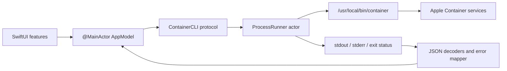
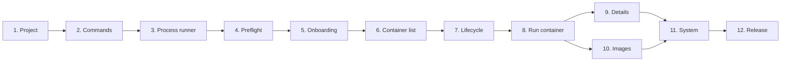

# Container GUI implementation plan

## 1. Product goal

Build a native macOS SwiftUI app that controls Apple's installed `container` command-line tool without requiring the user to remember CLI syntax.

The first useful release should let a user:

- verify that Apple Container is installed and its system service is available;
- view all containers and their current state;
- run, start, stop, and delete containers;
- view container details and logs;
- list, pull, and delete images;
- see progress, errors, and the exact command that was run.

### Assumptions

- "container CLI from Apple" means Apple's open-source [`apple/container`](https://github.com/apple/container) tool.
- This is a macOS app for Apple silicon, not an iPhone/iPad remote-control app.
- The `container` package is installed separately by the user. The app will not silently install, update, or embed Apple's CLI.
- The current project is an almost-empty macOS SwiftUI app, targets macOS 27, uses a file-system-synchronized Xcode group, and currently has App Sandbox enabled.

## 2. Recommended approach

Use `Foundation.Process` to execute the installed `container` binary and place all process handling behind a small, typed, asynchronous service layer.

For example, a refresh becomes:

```text
/usr/local/bin/container list --all --format json
```

The service decodes the JSON into app-owned models and publishes those models to SwiftUI. Mutating operations such as start and stop are also represented as typed Swift values; views never build command strings themselves.

### Why this approach

- It controls the same supported interface the user would use in Terminal.
- Apple's CLI already communicates with its background services and implements the container lifecycle correctly.
- JSON output is available for the important read operations, including container lists, image lists, system status, system version, inspect, and one-shot stats.
- Keeping the CLI behind a protocol makes command construction, decoding, error behavior, and UI state independently testable.
- It avoids depending on `apple/container` internal Swift modules or XPC protocols that can change independently of the CLI.
- It avoids reimplementing Apple's runtime with the lower-level `Containerization` package.

### Distribution and sandbox decision

For the MVP, distribute the app outside the Mac App Store using Developer ID signing and notarization:

- turn **App Sandbox off** for the app target;
- keep **Hardened Runtime on**;
- execute only an explicitly resolved `container` binary;
- never execute through `/bin/sh -c`, `/bin/zsh -c`, or another shell.

A child launched by `Process` inherits its parent's sandbox. The current sandbox would prevent a general-purpose CLI frontend from reliably accessing Apple's installed executable, service endpoints, bind-mount paths, Dockerfiles, and other user-selected host data.

Do not add a privileged helper merely to bypass App Sandbox. Most container operations do not need root access, and privileged system/DNS/kernel operations should be out of scope for v1. If Mac App Store distribution later becomes a requirement, treat that as a separate feasibility project with a narrowly scoped, signed helper and explicit security review.

## 3. Proposed architecture



### Core types

#### `ContainerCommand`

A typed command description that owns executable arguments, for example:

- `.systemStatus`
- `.systemVersion`
- `.listContainers(includeStopped: true)`
- `.inspectContainer(id:)`
- `.run(RunConfiguration)`
- `.start(id:)`
- `.stop(id: timeout:)`
- `.delete(id: force:)`
- `.logs(id: follow: tail:)`
- `.stats(ids:)`
- `.listImages`
- `.pullImage(reference:)`
- `.deleteImage(reference:)`

It produces an argument array, never a single shell command string. Validate container IDs, image references, port mappings, environment keys, and numeric limits before creating the command.

#### `ContainerCLI`

Define a protocol so production and test code use the same interface:

```swift
protocol ContainerCLI: Sendable {
    func run(_ command: ContainerCommand) async throws -> CommandResult
    func stream(_ command: ContainerCommand) -> AsyncThrowingStream<ProcessEvent, Error>
}
```

`CommandResult` should contain stdout, stderr, exit code, elapsed time, and a safe display form of the invocation.

#### `ProcessContainerCLI`

Implement the protocol as an `actor`:

- use an absolute executable URL;
- use `Process.arguments` rather than a shell;
- capture stdout and stderr separately with `Pipe`;
- read both pipes concurrently to avoid deadlocks;
- support cancellation by terminating the child process;
- decode text as UTF-8 with a safe replacement strategy;
- preserve stderr and exit code in a typed `CLIError`;
- set only a minimal, explicit environment while retaining required variables such as `HOME`, `PATH`, locale, and `SSH_AUTH_SOCK`;
- use `--progress plain` for long-running non-TTY operations where supported;
- assign operation IDs so UI progress and cancellation cannot become mixed up.

Do not mark process execution `@MainActor`. Only publish final state changes on the main actor.

#### App-owned models

Add small `Decodable`, `Identifiable`, and `Sendable` models:

- `ContainerSummary`
- `ContainerDetails`
- `ContainerState`
- `ContainerNetwork`
- `PortMapping`
- `ImageSummary`
- `SystemStatus`
- `SystemVersion`
- `ContainerStats`
- `RunConfiguration`
- `CLIError`

Keep raw CLI DTOs separate from view-facing models. Use tolerant decoding for optional fields because JSON shape may vary between CLI versions. Store unknown enum values instead of failing the whole refresh.

#### `AppModel`

Create one `@MainActor @Observable` composition root initially:

- owns the selected sidebar item;
- exposes containers, images, service health, running operations, and alerts;
- refreshes lists after successful mutations;
- prevents conflicting operations on the same resource;
- cancels log/stat streams when their detail view disappears;
- receives a `ContainerCLI` dependency in its initializer.

Feature-specific models can be split out later if `AppModel` becomes large.

## 4. CLI discovery and onboarding

At launch, run a preflight sequence:

1. Verify the Mac is Apple silicon and the OS is supported.
2. Look for `/usr/local/bin/container`, which is Apple's documented install location.
3. Optionally check `/opt/homebrew/bin/container` and a user-selected executable as fallbacks, but do not search by invoking a login shell.
4. Validate the candidate by running `container system version --format json`.
5. Save a persistent URL bookmark for a custom executable only if the user explicitly selects one.
6. Run `container system status --format json`.

Show a dedicated setup view for these states:

- CLI not found: link to Apple's releases/install instructions and offer **Choose Executable…**.
- CLI found but incompatible: show detected version and the supported range.
- Service stopped: offer **Start Service** with an explanation.
- Preflight failed: show stderr, exit code, a copyable diagnostic, and **Retry**.
- Ready: enter the main application.

Do not automatically download a package, request administrator privileges, or modify the user's installation.

## 5. User interface

Use a macOS `NavigationSplitView`.

### Sidebar

- **Containers**
- **Images**
- **System**
- **Settings**

Networks, volumes, builds, and persistent machines can be added after the container/image workflow is solid.

### Containers screen

- searchable table with name/ID, image, state, architecture, IP address, and created time;
- filter for all/running/stopped;
- toolbar actions for refresh and run;
- contextual actions for start, stop, view logs, inspect, and delete;
- disable invalid actions based on current state;
- confirmation dialog for delete and force-delete;
- optimistic busy indicator, followed by an authoritative refresh from the CLI.

### Run container sheet

MVP fields:

- image reference;
- optional container name;
- detached mode, on by default;
- remove when stopped;
- CPU and memory limits;
- port mappings;
- environment variables;
- command and arguments.

Build a preview such as `container run …` from the typed configuration. Keep bind mounts out of the very first slice unless file access and bookmarks are implemented at the same time.

### Container detail

- overview: status, image, resources, network addresses, ports, mounts;
- logs: initial tail plus optional follow mode, pause/autoscroll, copy, and clear display;
- inspect: formatted JSON fallback for fields the app does not yet model;
- stats: poll `container stats --no-stream --format json <id>` at a modest interval and stop polling when hidden;
- actions appropriate to current state.

An interactive `exec -it` terminal needs PTY support rather than ordinary pipes. Defer it until after v1; begin with non-interactive `exec` and an **Open command in Terminal** escape hatch if needed.

### Images screen

- list local images using `container image list --verbose --format json`;
- pull an image with streamed plain-text progress;
- inspect image JSON;
- delete with confirmation;
- refresh after pull/delete.

### System screen

- CLI and server versions;
- service status;
- disk usage via `container system df --format json`;
- recent service logs;
- start/stop service actions with confirmation for stop;
- copyable diagnostics bundle with app version, OS, architecture, CLI version, and sanitized errors.

Exclude administrator-only DNS and kernel mutation from v1.

## 6. Planned project structure

Because the Xcode project uses a file-system-synchronized group, new files placed under `container-gui/` should appear in the target without manually editing `project.pbxproj`.

```text
container-gui/
├── App/
│   ├── Container_GUIApp.swift
│   ├── AppModel.swift
│   └── AppDependencies.swift
├── CLI/
│   ├── ContainerCLI.swift
│   ├── ContainerCommand.swift
│   ├── ProcessContainerCLI.swift
│   ├── CommandResult.swift
│   ├── ProcessEvent.swift
│   └── CLIError.swift
├── Models/
│   ├── ContainerModels.swift
│   ├── ImageModels.swift
│   └── SystemModels.swift
├── Features/
│   ├── Setup/
│   ├── Containers/
│   ├── Images/
│   ├── System/
│   └── Settings/
├── Shared/
│   ├── LoadingState.swift
│   ├── ConfirmationSupport.swift
│   └── Formatters.swift
└── Assets.xcassets/

container-gui-tests/
├── ContainerCommandTests.swift
├── ProcessContainerCLITests.swift
├── CLIDecodingTests.swift
├── AppModelTests.swift
└── Fixtures/
```

## 7. Step-by-step build plan

Build the app as a sequence of small, independently testable increments. Each step should be a separate pull request or commit series. Do not start a later feature until the checkpoint for its dependency passes.

### Step 1 — Prepare the project

**Goal:** establish a secure, testable macOS application baseline.

**Tasks:**

- [x] Add a `Container GUITests` unit test target.
- [x] Lower the deployment target to macOS 26 if no macOS 27-only API is required; otherwise record why macOS 27 is necessary.
- [x] Turn App Sandbox off for Debug and Release.
- [x] Keep Hardened Runtime enabled.
- [x] Create the `App`, `CLI`, `Models`, `Features`, and `Shared` source folders.
- [x] Add an architecture decision record for CLI wrapping, distribution, sandboxing, and the no-shell rule.
- [x] Confirm the placeholder app and an empty test suite build from the command line.

**Deliverable:** a buildable project skeleton with a working test target.

**Checkpoint:** `xcodebuild build` and `xcodebuild test` both pass with no signing-dependent test failures.

### Step 2 — Define commands and domain models

**Goal:** represent supported CLI operations without executing a process yet.

**Tasks:**

- [x] Add `ContainerCommand` and generate `[String]` arguments for every MVP operation.
- [x] Add `RunConfiguration` with validation for names, ports, environment variables, CPU, and memory.
- [x] Add `CommandResult`, `ProcessEvent`, and `CLIError`.
- [x] Add the `ContainerCLI` protocol.
- [x] Add initial container, image, system, and version DTOs plus view-facing models.
- [x] Create JSON fixtures for the minimum and current supported Apple Container versions.
- [x] Test every generated argument array, including spaces, Unicode, quotes, and values beginning with a dash.

**Deliverable:** a fully unit-tested command/model layer with no dependency on the real CLI.

**Checkpoint:** views cannot construct raw CLI arguments; all MVP commands have passing argument tests.

### Step 3 — Build the process runner

**Goal:** execute non-interactive commands safely and asynchronously.

**Tasks:**

- [x] Implement `ProcessContainerCLI` as an actor.
- [x] Launch only an absolute executable URL using `Process.arguments`.
- [x] Capture stdout and stderr on separate pipes and read them concurrently.
- [x] Return exit status, output, duration, and a sanitized command description.
- [x] Map launch errors and nonzero exits to typed errors.
- [x] Propagate Swift task cancellation to the child process.
- [x] Size-limit retained output and handle invalid UTF-8 safely.
- [x] Create a test fixture executable that can emit output, errors, delays, and configurable exit codes.
- [x] Test large simultaneous stdout/stderr output to rule out pipe deadlocks.

**Deliverable:** a reliable async adapter for one-shot CLI commands.

**Checkpoint:** fixture-based tests prove success, failure, cancellation, timeout policy, and large-output behavior without requiring Apple Container.

### Step 4 — Add CLI discovery and preflight

**Goal:** tell the user exactly what must be fixed before the main UI can operate.

**Tasks:**

- [x] Check Apple silicon and the supported macOS version.
- [x] Look for `/usr/local/bin/container`.
- [x] Support a user-selected executable as a fallback and persist it as a URL bookmark.
- [x] Validate the executable with `container system version --format json`.
- [x] Parse and display CLI/server versions.
- [x] Check `container system status --format json`.
- [x] Model readiness as explicit states: checking, missing CLI, unsupported version, service stopped, failure, and ready.
- [x] Add retry and reset-custom-path actions.

**Deliverable:** a preflight service that converts installation state into a single typed readiness value.

**Checkpoint:** tests cover every readiness state, including malformed JSON and a binary that disappears after selection.

### Step 5 — Replace the placeholder with onboarding

**Goal:** provide a useful first-launch experience.

**Tasks:**

- [x] Create a setup screen driven by the preflight state.
- [x] Link missing-CLI users to Apple's installation instructions.
- [x] Add **Choose Executable…** and **Retry**.
- [x] Add **Start Service** only when the CLI is valid and the service is stopped.
- [x] Show sanitized stderr, exit code, and a copy-diagnostics action on failure.
- [x] Transition to the main navigation only when preflight reports ready.

**Deliverable:** a user can diagnose and resolve all supported setup conditions without opening the debugger.

**Checkpoint:** launch remains responsive, and UI tests cover missing, stopped, failed, and ready states using a fake CLI.

### Step 6 — Implement the read-only container list

**Goal:** display authoritative container state before adding mutations.

**Tasks:**

- [x] Implement `container list --all --format json`.
- [x] Decode output into `ContainerSummary` values with tolerant unknown-field handling.
- [x] Create `AppModel` as the `@MainActor @Observable` composition root.
- [x] Build a `NavigationSplitView` with Containers, Images, System, and Settings destinations.
- [x] Add a macOS table for ID/name, image, state, architecture, address, and creation time.
- [x] Add refresh, search, running/stopped filters, selection, empty state, and error state.
- [x] Prevent stale refresh results from replacing newer data.

**Deliverable:** a responsive, searchable container browser.

**Checkpoint:** fixture tests decode supported versions, and repeated refreshes never block the main thread or reorder newer state behind older results.

### Step 7 — Add lifecycle actions

**Goal:** manage existing containers safely.

**Tasks:**

- [x] Add start, graceful stop, and delete commands.
- [x] Enable actions according to container state.
- [x] Track busy state per container rather than globally.
- [x] Confirm delete and force-delete operations.
- [x] Prevent conflicting concurrent mutations on the same container.
- [x] Refresh the container list after every completed mutation.
- [x] Show actionable stderr when the requested transition fails.

**Deliverable:** existing containers can be started, stopped, and deleted from the list and detail toolbar.

**Checkpoint:** mutation tests cover success, CLI failure, cancellation, double-clicks, stale state, and post-action refresh.

### Step 8 — Add the run-container workflow

**Goal:** create a detached container from the GUI.

**Tasks:**

- [x] Build the run sheet with image, optional name, detach/remove options, CPU, memory, ports, environment, and command arguments.
- [x] Validate fields inline before enabling **Run**.
- [x] Show a safely escaped, display-only command preview.
- [x] Convert the form into `RunConfiguration`, then `ContainerCommand.run`.
- [x] Stream or display pull/run progress without blocking the form.
- [x] Close on success, select the new container, and refresh the list.
- [x] Preserve the form after failure so the user can correct it.

**Deliverable:** a user can run a typical detached web-service container without Terminal.

**Checkpoint:** run Alpine or another small pinned image, verify it appears in the list, then stop and delete it using the GUI.

### Step 9 — Add details, logs, and stats

**Goal:** make a selected container diagnosable.

**Tasks:**

- [ ] Decode `container inspect <id>`.
- [ ] Build an overview for resources, networks, ports, and mounts.
- [ ] Add raw formatted JSON for fields not yet represented by the UI.
- [ ] Implement `container logs` and followed logs using `AsyncThrowingStream`.
- [ ] Cap retained log lines and bytes.
- [ ] Support pause, resume, autoscroll, copy, clear display, and stream cancellation.
- [ ] Poll one-shot JSON stats at a modest interval only while the stats view is visible.
- [ ] Stop log and stats work when selection changes or the view disappears.

**Deliverable:** an overview/logs/inspect/stats container detail screen.

**Checkpoint:** streams terminate reliably, large logs remain usable, and no background polling remains after closing the detail view.

### Step 10 — Add image management

**Goal:** complete the image-to-container workflow.

**Tasks:**

- [ ] Implement `container image list --verbose --format json`.
- [ ] Build an image table with refresh, selection, and empty/error states.
- [ ] Add image inspection.
- [ ] Add pull with `--progress plain`, incremental progress display, and cancellation.
- [ ] Add image deletion with confirmation and conflict errors.
- [ ] Offer a selected image as the default in the run-container sheet.

**Deliverable:** users can pull, inspect, run, and delete images.

**Checkpoint:** pull a pinned image, run it, delete its container, and delete the image entirely through the app.

### Step 11 — Complete system status and diagnostics

**Goal:** expose operational health without adding dangerous administration features.

**Tasks:**

- [ ] Build the System screen with CLI/server versions and service health.
- [ ] Add disk usage from `container system df --format json`.
- [ ] Add recent service logs with bounded output.
- [ ] Add start/stop service actions, confirming stop.
- [ ] Build a sanitized diagnostics bundle containing app version, OS, architecture, CLI/server versions, recent operation failures, and exit codes.
- [ ] Exclude DNS, kernel, prune, and bulk `--all` mutations from v1.

**Deliverable:** a support-ready system and diagnostics screen.

**Checkpoint:** diagnostics contain enough information to reproduce failures but contain no environment values, registry credentials, or secrets.

### Step 12 — Test, harden, and release

**Goal:** ship a reliable Developer ID build.

**Tasks:**

- [ ] Add UI tests for onboarding and the main lifecycle using a fake CLI dependency.
- [ ] Run real smoke tests on clean Apple-silicon Macs with the minimum and current supported CLI versions.
- [ ] Test missing services, changed JSON, slow commands, network loss, corrupted output, and CLI upgrades.
- [ ] Verify VoiceOver, keyboard navigation, focus behavior, contrast, reduced motion, and large text.
- [ ] Confirm destructive operations always require appropriate confirmation.
- [ ] Audit output and diagnostics redaction.
- [ ] Archive with Developer ID, notarize, staple, and install on a second Mac.
- [ ] Document supported OS/CLI versions, install requirements, limitations, and troubleshooting.

**Deliverable:** a signed, notarized v1 application and release notes.

**Checkpoint:** the definition of done in section 12 passes on a clean Mac.

### Dependency order



## 8. Testing strategy

### Unit tests

- exact argument arrays for every command;
- validation of image references, names, environment keys, mounts, ports, CPU, and memory;
- decoding representative and partially unknown JSON;
- mapping process exits and stderr to user-facing error categories;
- reducer/model behavior for refresh, mutation, cancellation, and stale results.

### Process integration tests

Use a test-only fixture executable that can:

- emit JSON to stdout;
- emit warnings/errors to stderr;
- exit with configurable status;
- stream lines slowly;
- ignore or respond to termination;
- emit enough data to expose pipe deadlocks.

This tests `Process` behavior without altering real containers.

### Real CLI smoke tests

Gate these tests behind an explicit environment flag and use uniquely prefixed disposable resources:

1. check system status;
2. pull a small pinned image;
3. run a detached named container;
4. list and inspect it;
5. read logs and stats;
6. stop and delete it;
7. delete the test image only if the test pulled it and it was not present before.

Cleanup must be targeted and best-effort; never use global `--all` or prune commands in automated tests.

## 9. Security and reliability rules

- Never pass user input through a shell.
- Resolve and validate the executable once; reject directories and non-executable files.
- Treat all CLI output as untrusted and size-limit retained output.
- Redact values for environment variables whose keys resemble secrets, tokens, keys, or passwords.
- Require confirmation for delete, force delete, prune, system stop, and any future destructive bulk action.
- Do not expose `--all`, prune, registry login, privileged DNS, or kernel changes until each has dedicated UX and tests.
- Keep registry credentials in Keychain if registry login is added later.
- Persist user-selected Dockerfiles, build contexts, mounts, import/export files, and custom CLI paths as URL bookmarks. Security-scoped access becomes necessary only if a future distribution re-enables App Sandbox.
- Serialize conflicting mutations per resource while allowing independent read operations.
- After every mutation, trust a fresh CLI read rather than assuming the desired state.
- Surface the exact exit code and sanitized stderr; do not collapse every failure into "Something went wrong."

## 10. Compatibility strategy

- Detect CLI/server version during preflight and show it in Settings.
- Maintain an explicit tested-version range in code.
- Prefer documented JSON flags over parsing human tables.
- Use tolerant decoding and record unknown fields/states.
- If a required JSON command or field is unavailable, disable only the affected feature and explain why.
- Add fixtures and smoke-test coverage before declaring a new CLI version supported.
- Pin links in release notes to the command reference for the tested Apple Container release, because the `main` branch documents unreleased changes.

## 11. Deferred features

After v1 is stable:

- networks and volumes;
- builds from a Dockerfile and build-context bookmarks;
- registry authentication and Keychain storage;
- interactive terminal with a real PTY;
- file copy and import/export;
- persistent `container machine` management;
- menu-bar status and notifications;
- remote control from iPhone/iPad through a separately authenticated Mac agent.

Remote access should not be implemented by exposing a raw shell or unauthenticated HTTP endpoint. It requires a separate threat model, pairing/authentication, encrypted transport, command authorization, and audit trail.

## 12. Definition of done for v1

The MVP is complete when:

- a first-time user gets a clear setup path;
- the UI never blocks while a CLI process runs;
- list/run/start/stop/delete/logs/inspect and image list/pull/delete work on a supported Apple-silicon Mac;
- every destructive action is confirmed;
- cancellation reliably terminates long-running child processes;
- unit, fake-process integration, UI, and real CLI smoke tests pass;
- the app is Developer ID signed and notarized;
- supported OS and Apple Container versions are documented.

## 13. Primary references

- [Apple Container repository and installation requirements](https://github.com/apple/container)
- [Apple Container command reference](https://github.com/apple/container/blob/main/docs/command-reference.md)
- [Apple Container technical overview](https://github.com/apple/container/blob/main/docs/technical-overview.md)
- [Apple: Process](https://developer.apple.com/documentation/foundation/process)
- [Apple: Embedding a command-line tool in a sandboxed app](https://developer.apple.com/documentation/xcode/embedding-a-helper-tool-in-a-sandboxed-app)
- [Apple: Accessing files from the macOS App Sandbox](https://developer.apple.com/documentation/security/accessing-files-from-the-macos-app-sandbox)

Research checked on 2026-07-30. Confirm behavior against the exact Apple Container release selected for implementation.
